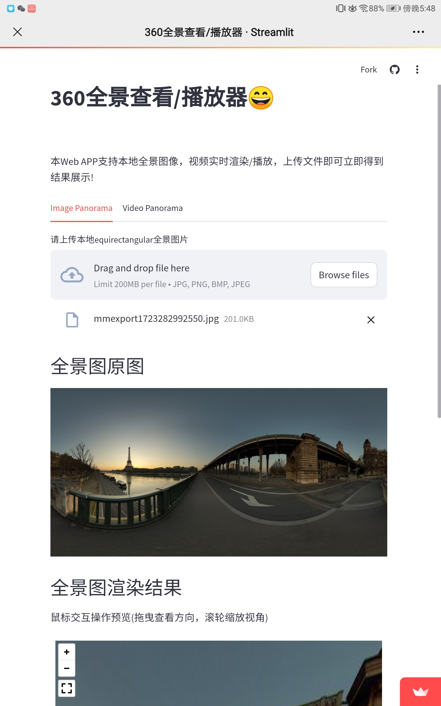

# 360-degree web panorama viewer and video player

Using open web technology to support local uploads of 360-degree panoramic images and videos for interactive viewing and playback! Accessible across all platforms!

## Demos

